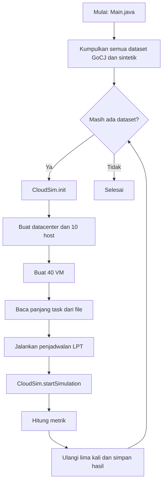

# Simulasi Penjadwalan Task LPT di CloudSim

Proyek simulasi penjadwalan task menggunakan algoritma **Longest Processing
Time (LPT)** pada **CloudSim 3.0.3** dan dataset **GoCJ (Google Cloud Jobs)**.

- **Algoritma:** task diurutkan dari yang terpanjang, lalu dialokasikan ke slot
  vCPU dengan waktu selesai paling awal.
- **Tujuan:** membandingkan makespan dan biaya penjadwalan.
- **Metrik:** Makespan, Total Cost, Resource Utilization, Degree of Imbalance,
  Throughput, dan Scheduling Time.

## Daftar isi

1. [Alur simulasi](#1-alur-simulasi)
2. [Algoritma LPT](#2-algoritma-lpt)
3. [Arsitektur datacenter dan VM](#3-arsitektur-datacenter-dan-vm)
4. [Dataset](#4-dataset)
5. [Struktur proyek](#5-struktur-proyek)
6. [Rumus metrik](#6-rumus-metrik)
7. [Cara menjalankan](#7-cara-menjalankan)
8. [Hasil](#8-hasil)
9. [Asumsi dan keterbatasan](#9-asumsi-dan-keterbatasan)
10. [Sumber dan sitasi](#10-sumber-dan-sitasi)

---

## 1. Alur simulasi

Satu kali menjalankan `Main` memproses semua file GoCJ di `data/` (100 sampai
1000 task dengan kenaikan 50) dan dataset sintetik 100 sampai 1000, lalu 2000
dan 3000 task. Setiap dataset dijalankan lima kali. Simulasi CloudSim
diinisialisasi ulang untuk setiap run.



## 2. Algoritma LPT

Task terpanjang ditempatkan lebih dahulu. Untuk mendukung VM multi-core,
penjadwal menggunakan satu slot per vCPU.

1. Urutkan task berdasarkan panjang MI secara menurun.
2. Buat slot untuk setiap vCPU, dengan waktu tersedia awal 0.
3. Untuk setiap task, hitung waktu selesai pada setiap slot:
   `waktu tersedia slot + panjang task / MIPS vCPU`.
4. Pilih slot dengan waktu selesai paling awal, tetapkan task ke VM slot itu,
   lalu perbarui waktu tersedia slot.
5. Ulangi sampai semua task dialokasikan.

```text
sorted = sort(tasks, by length, descending)
slots  = [(vm, freeAt=0) for each vm for each vCPU of vm]
for task in sorted:
    best = argmin over slots of (slot.freeAt + task.length / slot.vm.mips)
    best.freeAt = best.freeAt + task.length / best.vm.mips
    assign(task, best.vm)
```

Contoh untuk 5 task dan 3 VM satu-vCPU (A = 3000, B = 1500, C = 1000 MIPS):

| Urutan | Task (MI) | VM yang dipilih | Waktu selesai |
|---|---:|---|---:|
| 1 | 9000 | A | 3,00 s |
| 2 | 6000 | B | 4,00 s |
| 3 | 4000 | C | 4,00 s |
| 4 | 3000 | A | 4,00 s |
| 5 | 2000 | A | 4,67 s |

Makespan contoh tersebut adalah **4,67 s**.

LPT berfokus pada waktu selesai, bukan harga VM. Karena itu, VM berbiaya lebih
tinggi dapat ikut digunakan untuk mengurangi makespan dan menaikkan total biaya.

## 3. Arsitektur datacenter dan VM

### Host (1 datacenter, 10 host)

| Jenis | ID host | Jumlah | Core | MIPS/core | RAM | Storage | Bandwidth |
|---|---|---:|---:|---:|---:|---:|---:|
| Server High Performance | 0–3 | 4 | 8 | 3000 | 32 GB | 1 TB | 10 Gbps |
| Server Standard | 4–9 | 6 | 4 | 1500 | 16 GB | 500 GB | 1 Gbps |

### VM (40 VM)

| Jenis | Jumlah | vCPU | MIPS/vCPU | RAM | Bandwidth yang dipakai | Tarif |
|---|---:|---:|---:|---:|---:|---:|
| Compute-Intensive | 10 | 2 | 2500 | 8 GB | 1 Gbps | 150 G$/s |
| Standard | 20 | 1 | 1500 | 4 GB | 250 Mbps | 40 G$/s |
| Light-weight | 10 | 1 | 800 | 2 GB | 250 Mbps | 18 G$/s |

Compute-Intensive hanya dialokasikan ke host High Performance. Host Standard
memiliki 1500 MIPS/core, di bawah kebutuhan 2500 MIPS/vCPU VM tersebut.

Bandwidth Standard menggunakan 250 Mbps. Angka spesifikasi awal 5000 Mbps per
VM akan melebihi bandwidth host yang tersedia jika digunakan oleh seluruh VM.

Penempatan host memakai `VmAllocationPolicySimple` CloudSim 3.0.3. Hasil
penempatan dicatat ke `results/host_vm_placement.csv`.

## 4. Dataset

Setiap file berisi satu angka per baris yang menyatakan panjang satu task dalam
Million Instructions (MI).

### 4.1 GoCJ

Dataset resmi berisi 19 file: `GoCJ_Dataset_100.txt` sampai
`GoCJ_Dataset_1000.txt`, dengan kenaikan 50 task. Seluruh file ditempatkan di
`data/`; nama file menunjukkan jumlah task.

Sumber dataset menyebut GoCJ sebagai ukuran job dalam MI yang diturunkan dari
perilaku workload pada Google cluster traces. Nilai GoCJ dapat jauh lebih besar
dari rentang sintetik 1.000–50.000 MI. Batas kategori laporan yang digunakan
oleh `Main.java` adalah:

- Pendek: sampai dengan 100.000 MI
- Sedang: 100.001–350.000 MI
- Panjang: di atas 350.000 MI

Batas tersebut adalah definisi untuk analisis proyek, bukan klasifikasi resmi
dari dataset.

### 4.2 Sintetik

`DatasetGenerator` membuat dataset secara deterministik dan menyimpannya di
`data/synthetic/Synthetic_<jumlah task>.txt`. Komposisi:

| Kelas | Porsi | Panjang task |
|---|---:|---:|
| Kecil | 30% | 1.000–10.000 MI |
| Sedang | 40% | 10.001–30.000 MI |
| Besar | 30% | 30.001–50.000 MI |

Nilai dipilih secara acak seragam dalam rentang kelas, lalu urutannya diacak.
Seed adalah `42 + jumlah task`, sehingga data dapat diulang. File sintetik yang
sudah ada digunakan apa adanya. Hapus `data/synthetic/` untuk membuat ulang
semua file sintetik.

Ukuran sintetik yang diproses: 100, 200, 300, 400, 500, 600, 700, 800, 900,
1000, 2000, dan 3000 task.

### 4.3 Label beban kerja

| Label | Jumlah task |
|---|---:|
| Ringan | 100–300 |
| Sedang | 301–700 |
| Berat | 701–1000 |
| Sangat berat | Di atas 1000 |

Label ini adalah definisi analisis proyek.

Ukuran file input Cloudlet diacak pada rentang 300–10.000 KB dengan seed tetap.
Ukuran transfer tersebut tidak memengaruhi waktu eksekusi pada model ini.

## 5. Struktur proyek

```text
cloudsim-lpt-scheduler/
├── data/
│   ├── GoCJ_Dataset_100.txt ... GoCJ_Dataset_1000.txt
│   └── synthetic/                 # dibuat otomatis saat program dijalankan
├── lib/cloudsim-3.0.3.jar
├── results/                       # dibuat otomatis saat program dijalankan
│   ├── dataset_stats.csv
│   ├── hasil_lpt.csv
│   ├── hasil_lpt_runs.csv
│   └── host_vm_placement.csv
├── pom.xml
└── src/main/java/com/cloudsim/lpt/
    ├── Main.java
    ├── DatacenterFactory.java
    ├── VmFactory.java
    ├── CloudletGenerator.java
    ├── DatasetGenerator.java
    ├── DatasetStats.java
    └── LptScheduler.java
```

| Class | Tugas |
|---|---|
| `Main` | Mengumpulkan dataset, menjalankan tiap dataset lima kali, menghitung rata-rata, dan menyimpan hasil. |
| `DatacenterFactory` | Membuat satu datacenter dengan sepuluh host. |
| `VmFactory` | Membuat 40 VM dan menyediakan tarif biaya tiap jenis VM. |
| `CloudletGenerator` | Membaca panjang task dari satu file dataset menjadi Cloudlet. |
| `DatasetGenerator` | Membuat dan menyimpan dataset sintetik 30/40/30. |
| `DatasetStats` | Menghitung statistik dan persentase task pendek/sedang/panjang. |
| `LptScheduler` | Menjadwalkan task dengan LPT dan menghitung metrik simulasi. |

## 6. Rumus metrik

| Metrik | Rumus |
|---|---|
| Makespan | Waktu selesai maksimum semua task |
| Total Cost | Untuk setiap VM, waktu penyelesaian task terakhir × tarif VM; VM tanpa task berbiaya 0 |
| Resource Utilization | Total waktu CPU terpakai / (jumlah vCPU × makespan) × 100% |
| Degree of Imbalance | (Tmax − Tmin) / Tavg, berdasarkan waktu selesai tiap VM yang mendapat task |
| Throughput | Jumlah task selesai / makespan |
| Scheduling Time | Waktu komputasi penjadwal LPT dalam milidetik |

## 7. Cara menjalankan

Prasyarat: Java 8 atau lebih baru dan Maven.

Dari direktori `cloudsim-lpt-scheduler/`:

```bash
mvn compile
mvn exec:java
```

`exec-maven-plugin` menggunakan classpath compile Maven agar CloudSim dari
`lib/cloudsim-3.0.3.jar` tersedia saat runtime. Hasil ditampilkan di console
dan disimpan di `results/`.

## 8. Hasil

Setiap dataset dijalankan lima kali. Metrik utama seharusnya deterministik dan
sama pada tiap run; waktu penjadwalan dapat sedikit berubah.

| File di `results/` | Isi |
|---|---|
| `hasil_lpt.csv` | Rata-rata lima run per dataset |
| `hasil_lpt_runs.csv` | Hasil setiap run |
| `dataset_stats.csv` | Min, kuartil, median, max, rata-rata, dan persentase kategori task |
| `host_vm_placement.csv` | Jumlah VM per host dan jenis VM |

Analisis hasil dapat membandingkan perubahan makespan, utilization, imbalance,
dan cost seiring bertambahnya jumlah task, serta perbedaan antara GoCJ dan
dataset sintetik.

## 9. Asumsi dan keterbatasan

1. Bandwidth VM Standard menggunakan 250 Mbps, bukan angka awal 5000 Mbps,
   untuk menyesuaikan total kebutuhan bandwidth dengan kapasitas host.
2. Ukuran file transfer diacak 300–10.000 KB dan tidak memengaruhi waktu
   eksekusi pada model ini.
3. Cost dihitung dari waktu 0 sampai task terakhir di VM selesai, dikalikan
   tarif per detik.
4. Satu task memakai satu vCPU; VM Compute-Intensive dapat menjalankan dua
   task secara paralel karena memiliki dua vCPU.
5. Model adalah batch statis dan non-preemptive: semua task tersedia pada waktu
   0, tidak ada migrasi VM atau auto-scaling.
6. Seed tetap digunakan untuk ukuran file dan dataset sintetik agar hasil
   dapat diulang.
7. Hasil berlaku untuk CloudSim 3.0.3 dan algoritma LPT yang digunakan di
   proyek ini; tidak ada algoritma pembanding.
8. Batas kelas panjang task GoCJ dan label beban adalah definisi analisis
   proyek, bukan standar dataset.
9. Penempatan VM menggunakan kebijakan bawaan CloudSim.

## 10. Sumber dan sitasi

Dataset diunduh dari Mendeley Data:

> Hussain, A., & Aleem, M. (2018). *GoCJ: Google Cloud Jobs Dataset* (Version
> 1). Mendeley Data. https://doi.org/10.17632/b7bp6xhrcd.1

Dataset berlisensi **CC BY 4.0**. Artikel terkait:

> Hussain, A., Aleem, M., Khan, A., et al. (2018). *GoCJ: Google Cloud Jobs
> Dataset for Distributed and Cloud Computing Infrastructures*. Cluster
> Computing. https://doi.org/10.1007/s10586-018-2414-6